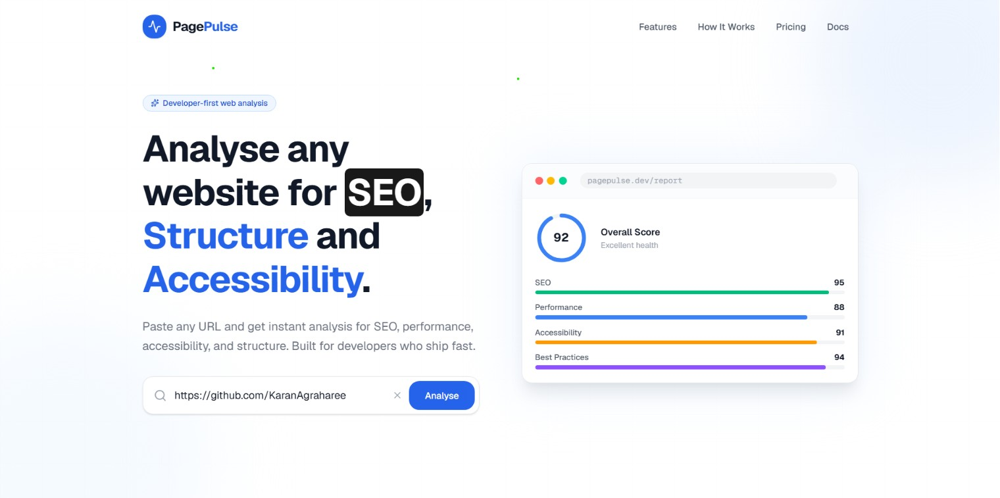
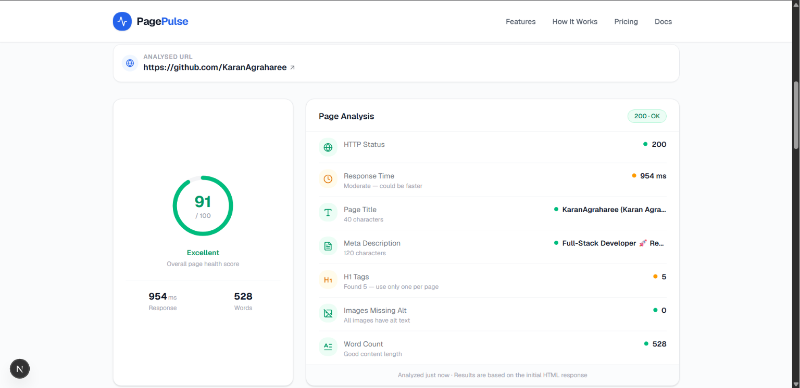

# 🚀 Page Pulse

> **Instant Website Health Analyser built with Next.js**

Page Pulse is a modern full-stack web application that analyses any public website URL and provides valuable insights into its HTTP status, response time, SEO metadata, heading structure, accessibility, and content statistics.

This project was developed as part of the **Digital Heroes Software Development Internship Qualification Task**.

---

## 🌐 Live Demo

**Application:** 

https://page-pulse-mauve-kappa.vercel.app

## 📂 GitHub Repository

https://github.com/KaranAgraharee/Page-Pulse

---
## 🎬 Loom Vedio

https://www.loom.com/share/9f761c21c1c445fca0b2029d3c47d040

---

# 📸 Screenshots

## Landing Page



---

## Analysis Report


---

## Error Handling



---

# ✨ Features

- Analyse any public website URL
- Measure HTTP response time
- Display HTTP status codes
- Extract page title
- Extract meta description
- Count H1 headings
- Detect images with missing `alt` attributes
- Calculate approximate word count
- Responsive interface across desktop and mobile devices
- Robust error handling for invalid URLs, timeouts and non-HTML responses

---

# 🛠 Tech Stack

### Frontend

- Next.js
- React
- TypeScript
- Tailwind CSS
- Lucide React

### Backend

- Next.js Route Handlers
- Axios
- Cheerio
- Zod

### Testing

- Vitest

---

# 📁 Project Structure

```text
app/
├── api/
│   └── analyze/
│       └── route.ts
│
├── components/
│   ├── Navbar.tsx
│   ├── HeroSection.tsx
│   ├── UrlForm.tsx
│   ├── ReportSection.tsx
│   ├── FeaturesSection.tsx
│   ├── HowItWorksSection.tsx
│   ├── CTASection.tsx
│   └── Footer.tsx
│
├── lib/
│   ├── analyzer.ts
│   ├── parser.ts
│   ├── validator.ts
│   └── errors.ts
│
├── globals.css
├── layout.tsx
└── page.tsx

screenshots/

README.md

package.json
```

> **Note:** Replace the folder names above if they differ in your project.

---

# ⚙️ Getting Started

## Clone the repository

```bash
git clone https://github.com/KaranAgraharee/Page-Pulse.git
```

Move into the project directory.

```bash
cd Page-Pulse
```

Install dependencies.

```bash
npm install
```

Start the development server.

```bash
npm run dev
```

Open your browser and visit:

```text
http://localhost:3000
```

---

# 📡 API

## POST `/api/analyse`

Accepts a website URL and returns an analysis report.

### Request

```json
{
  "url": "https://example.com"
}
```

### Response

```json
{
  "status": 200,
  "responseTime": 356,
  "title": "Example Domain",
  "metaDescription": "...",
  "h1Count": 1,
  "missingAltImages": 0,
  "wordCount": 287
}
```

---

# 🧪 Running Tests

Run all tests.

```bash
npm test
```

or

```bash
npx vitest
```

---

# 💡 Design Decisions

### Separation of Responsibilities

The HTML parsing logic is separated from the API route, making the code easier to maintain, reuse and test.

### Input Validation

Every request is validated using **Zod** before any processing begins, ensuring only valid URLs are accepted.

### Error Handling

The application gracefully handles invalid URLs, network failures, timeouts and non-HTML responses, displaying clear feedback rather than exposing technical errors.

---

# 🚀 Future Improvements

- Google Lighthouse integration
- Core Web Vitals reporting
- Export reports as PDF
- Historical analysis
- Website comparison
- Multi-page crawling

---

# 👨‍💻 Author

**Karan Agrahari**

GitHub:  
https://github.com/KaranAgraharee

LinkedIn:  
https://www.linkedin.com/in/YOUR-LINKEDIN/

---

# 📄 Acknowledgements

This project was created for the **Digital Heroes Software Development Internship Qualification Task**.

The footer of the live application includes the required attribution:

> **Built for Digital Heroes Training Task**

---

## ⭐ If you found this project interesting, please consider giving it a star.
